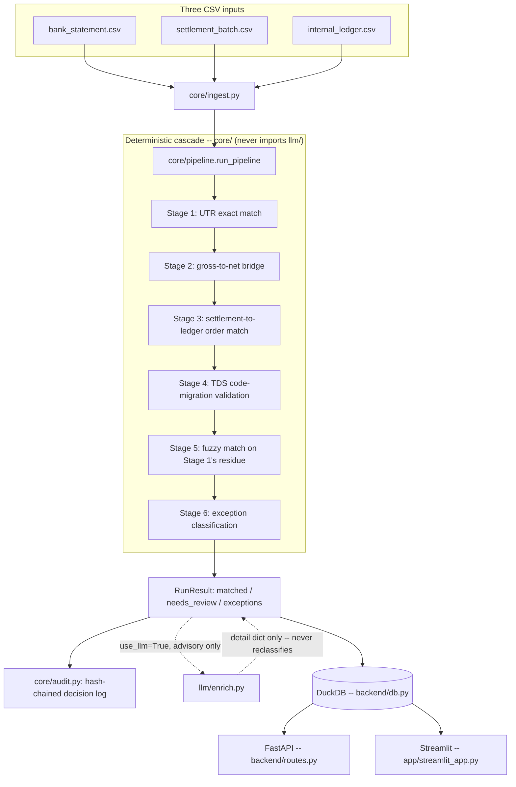

# MANIFEST

[](https://github.com/subinita01/Manifest---Razorpay-AI-builder-Hackathon/actions/workflows/ci.yml)

**Live demo:** [manifest---razorpay-ai-builder-hackathongit-gqvpypgmk6jyx9fq3a.streamlit.app](https://manifest---razorpay-ai-builder-hackathongit-gqvpypgmk6jyx9fq3a.streamlit.app/) -- no install required, the demo dataset loads with one click.

MANIFEST is a settlement, tax-line, and exception auditor for Razorpay-style payment reconciliation, built for the Razorpay AI Buildathon Track 04.

**It tells you what it couldn't match.**

A reconciliation tool that reports 100% match is lying to you or hiding the mess in a bucket nobody reads. MANIFEST runs a deterministic 6-stage matching cascade over your bank statement, settlement batch, and internal ledger, reconstructs the gross-to-net settlement bridge, validates the incoming TDS code migration, and emits an honest, taxonomy-coded exception list for everything it couldn't resolve on its own -- with an append-only, hash-chained audit trail behind every decision.

## Headline numbers

From `make eval`, against the committed demo dataset (seed 42, 600 orders, 1,273 total rows across all three inputs) -- full detail in [evaluation/results/ablation.md](evaluation/results/ablation.md) and [threshold_sweep.md](evaluation/results/threshold_sweep.md):

| Metric | Value |
|---|---|
| Auto-match rate | 62.9% |
| Matcher precision | 1.000 |
| Matcher recall | 0.733 |
| False-positive cost | Rs 0.00 |
| Total exceptions raised | 45 (covering 269 of 1,273 rows) |
| UNEXPLAINED (system refused to guess) | 3 |
| Core invariant (matched + needs_review + exceptions == total) | holds |

The LLM-advisory row in the same table reports **zero uplift on every core metric, by design** -- see [Architecture: the LLM contract](ARCHITECTURE.md#the-llm-contract) for why that's a guarantee, not a shortfall.

## Who this is for

Two people, two very different reasons to open this tool.

### Priya, finance associate -- the Tuesday before month-end close

**Before MANIFEST:** three exports open in three tabs -- a bank statement with one lumped NEFT credit and narration like `UPI-SETTLEMENT-8f3a...`, a settlement batch with 187 constituent payments, an internal ledger with gross invoice amounts. She's manually cross-referencing rows in a spreadsheet, hoping she doesn't miss the one line carrying a TDS code that doesn't exist yet under the new schedule. If she does, it surfaces three weeks later as a books mismatch with her sign-off on it.

**With MANIFEST:** she loads the three files (or the one-click demo) and 1,273 rows are triaged in under a second -- 1,001 already match, 3 need a second look, 269 are explicitly flagged, not buried. She opens the Bridge tab on the big NEFT credit and watches it decompose visually into fees, GST, and refunds -- the exact math a spreadsheet formula chain used to hide. In the Manifest tab she filters straight to CRITICAL severity, and for the one she doesn't immediately follow, she types a question into "Ask about this run" instead of digging through raw JSON. She exports the real leftover list as a CSV for her manager, done before the deadline.

**What actually changed:** the tool never lets her accidentally certify a false "everything's fine." It finishes the certain 90%+ instantly and hands back exactly the fraction that needs a human -- which is the actual job, not the busywork around it.

### Arjun, finance controller -- signing off on the close

**Before MANIFEST:** he signs off on adjustments based on what associates hand him -- a spreadsheet, a claim that "it reconciles." If an auditor asks how he knows it wasn't quietly force-matched to look clean, his honest answer is that he trusts the person who ran it, nothing more. And this year there's a new risk: the TDS code migration means the join key itself is changing mid-year, and he has no way to know if that's silently breaking something until a filing gets rejected.

**With MANIFEST:** he opens the Metrics tab and sees precision and recall scored against real planted ground truth, including an ablation table proving the LLM layer contributes exactly zero to the actual matching decision -- the reasoning spelled out, not hidden. He scrolls to the footer and clicks "Verify audit chain" -- live, in front of him, a cryptographic check confirms nothing in the decision trail has been altered since it was written. Every exception traces back to a real row ID and a real number.

**What actually changed:** he's no longer signing off on trust -- he's signing off on a system that structurally cannot fake its own numbers, and can prove on demand that its record hasn't been touched.

## Why this matters

Razorpay already runs Recon at 200 million transactions a month -- a generic reconciler pitch would be a worse clone of something that already exists, and any panel would say so immediately. What MANIFEST actually targets is the one gap Recon's public material doesn't claim: starting this financial year, the TDS code taxonomy itself changes shape mid-year (legacy section codes give way to numeric payment codes), meaning the join key a merchant's books depend on is moving underneath them. That's not a "match harder" problem -- it needs a system built to expect the join key to break.

The risk this protects against isn't abstract. A reconciliation tool that silently force-matches through that transition can cause a merchant's input-tax-credit claim to break quietly, discovered weeks later -- and the platform they reconciled through is the first place blame lands, fair or not. A tool that refuses to fake a match, and can prove it refused, is a trust and liability reducer for whoever sits between the merchant and their books.

There's also a more durable asset here than the specific TDS exception class: the pattern of exactly *how much* an LLM is allowed to touch a financial decision -- explain, draft, never decide -- is directly reusable anywhere an engineering team is nervous about bringing AI near money, not just this one workflow. The impact isn't "one more reconciliation feature"; it's a demonstrated, provable answer to the question every fintech eventually has to answer about AI: not *whether* to use it, but exactly *where the line is* and how you prove you never crossed it.

## Architecture

**In plain English, before the diagram:** think of the six-stage cascade as a careful mail-sorting line, not one black box. Stage 1 pulls out the obvious matches -- a bank credit and a settlement batch sharing the exact same reference and amount. Whatever's left goes to Stage 2, which is like showing your work on a math problem: it rebuilds each settlement's fees and taxes step by step so you can watch where the money actually went, instead of being told "trust me." Stages 3 and 4 do the same careful checking on the tax-code side, catching exactly the kind of code-migration break this year is about to cause everywhere. Stage 5 is the "use judgment, carefully" stage -- fuzzy matching for the messy leftovers, refusing to guess on a genuine toss-up rather than picking one arbitrarily. Stage 6 is where anything still unexplained gets labeled honestly instead of forced into a slot it doesn't belong in.

The AI in this system is kept on a short leash on purpose: it's allowed to write an explanation or draft a suggested fix, the way a junior analyst's work always needs a senior sign-off -- except here the "senior" is fixed math logic that can't be talked into anything, tricked, or have a bad day. That's provable, not just claimed: the code that makes the actual decision has no way to call the AI at all.

Every decision also gets written into a locked notebook where each new entry carries a fingerprint of the one before it -- so if anyone ever went back and edited an old entry, the fingerprints would stop lining up immediately, not get discovered by accident months later. And the exact tax-code mappings this all depends on live in a plain settings file, not buried in code -- so when the government finalizes the real numbers, fixing it is a spreadsheet-style edit, not a software rewrite.



Full design rationale, the LLM guardrails, and the known scaling limit: [ARCHITECTURE.md](ARCHITECTURE.md).

## Quickstart

```bash
make install     # creates .venv, installs requirements.txt
make demo-data   # generates data/demo/ (seed 42, 600 orders) -- already committed, but reproducible
make eval        # writes evaluation/results/ablation.md and threshold_sweep.md
make demo        # streamlit run app/streamlit_app.py
```

Four commands, no API key required -- `use_llm` defaults to off, and even switched on with no key set, the app runs end to end against the deterministic `NullAdapter` fallback. Want to see the live LLM path without a paid key? `build_adapter_from_env` checks `ANTHROPIC_API_KEY` first, then `GEMINI_API_KEY` (free tier at [aistudio.google.com](https://aistudio.google.com/apikey) -- caps at 20 requests/day/model, easy to exhaust), then `NVIDIA_API_KEY` (a DeepSeek model via [build.nvidia.com](https://build.nvidia.com) -- correct, but noticeably slower per call than the other two).

## Try the upload flow with your own CSVs

The Upload tab's "Load demo dataset" button is one click, but the app also accepts arbitrary bank/settlement/ledger CSVs through its own upload form -- to actually exercise that path rather than just the pre-loaded demo, [data/sample_upload/](data/sample_upload/) has a second, independently generated dataset (seed 7, different from the seed-42 demo) ready to upload: `bank_statement.csv`, `settlement_batch.csv`, `internal_ledger.csv`. Pick those three in the Upload tab, click "Validate and use these files," then Run -- it produces a genuinely different result (1,057 matched / 9 needs review / 207 exceptions, vs. the demo's 1,001 / 3 / 269), proving the run reflects whatever you actually uploaded. `ground_truth.json` is included alongside it for anyone who wants to verify MANIFEST's output independently, same as the main demo dataset -- it isn't one of the three files you upload.

## What this deliberately does NOT do

- No real bank or Razorpay API integration -- CSV in, CSV/DuckDB out.
- No multi-tenant auth, user accounts, or RBAC.
- Never posts an entry to any accounting system -- adjustment drafts are drafts, always.
- No PDF/OCR invoice parsing, no multi-currency or cross-border handling, nothing real-time or streaming, no GST return filing.
- **It does not claim 100% match.** A run reporting zero exceptions is a failed run, and the UI says so.
- **The LLM never clears a match, and never can.** It explains and drafts. Deterministic code in `core/` decides, and `core/` has no import path to `llm/` at all.

## Security

Full threat model and mitigating controls: [SECURITY.md](SECURITY.md). The one line that matters for a panel: bank narration text is wrapped in an `<untrusted_data>` tag before it ever reaches the LLM, and a deterministic keyword scan flags suspicious narration *before* any adapter is consulted -- so even an adversarial LLM response that claims an injected row is "a clean, high-confidence match" cannot change the match outcome. Proven in `tests/test_prompt_injection.py` against an adapter built to try exactly that.

## A known gap, on purpose

`config/tds_code_map.yaml` -- the legacy-section-to-new-numeric-code mapping for the FY 2026-27 TDS migration -- ships with every entry marked `verified: false`. These are placeholder values pending confirmation against the official CBDT notification; the file is the single source of truth precisely so that correcting them later requires editing YAML, not refactoring `core/`. MANIFEST treats an unverified or contradicted mapping as a first-class `TDS_CODE_MIGRATION_BREAK` exception rather than silently trusting it.

## Repository shape

- `app/` -- Streamlit demo (Upload, Run, Bridge, Manifest, Metrics tabs)
- `backend/` -- FastAPI service, DuckDB persistence, security controls, audit wiring
- `core/` -- the deterministic matching cascade and schema contracts (`llm/`-free, 95%+ test coverage)
- `llm/` -- optional advisory layer (narration classification, root-cause narrative, adjustment drafts, and an on-demand natural-language Q&A over a run's exceptions)
- `config/` -- YAML configuration (TDS code map, tolerances, chart of accounts)
- `data/` -- synthetic generator, the committed demo dataset (seed 42) with ground truth, and a second sample dataset (seed 7) for testing the manual upload flow
- `evaluation/` -- metrics, ablation, and threshold-sweep scoring against ground truth
- `scripts/` -- CI smoke test and demo utilities
- `tests/` -- unit, integration, and security regression tests
